# BSPWM | Polybar themes collection - Rice selector

|DIstro|[Arch](https://archlinux.org/)|
|:---:|:---:|
|WM|[BSPWM](https://github.com/baskerville/bspwm)|
|Bar|[Polybar](https://github.com/polybar/polybar)|
|Menu|[Rofi](https://github.com/davatorium/rofi)|
|Compositor|[Picom Arian8j2](https://github.com/Arian8j2/picom)|
|Terminal|[Termite](https://aur.archlinux.org/termite.git)|
|Widgets|[ElKowars wacky widgets ](https://github.com/elkowar/eww)|

## 📖 Features
* **Change RICE on the fly:** 11 different Rices now!.

* **Rice Selector:** <code>Alt + Space bar</code> to launch it.

* **Random wallpaper:**  Every time you switch between rices or reload bspwm with <code>super + alt + r</code> a new wallpaper is set depending on the rice you are on.

* **Super + Alt + w** changes bethween different wallpapers in the actual rice.

* **Hide / Unhide Bar:** (Polybar)


https://user-images.githubusercontent.com/88548908/193978019-da74358b-d59d-470b-a4a1-69251d7a1bcd.mp4


### 🌸Emilia:

- Color Palette: <code>Tokyo Night</code>

|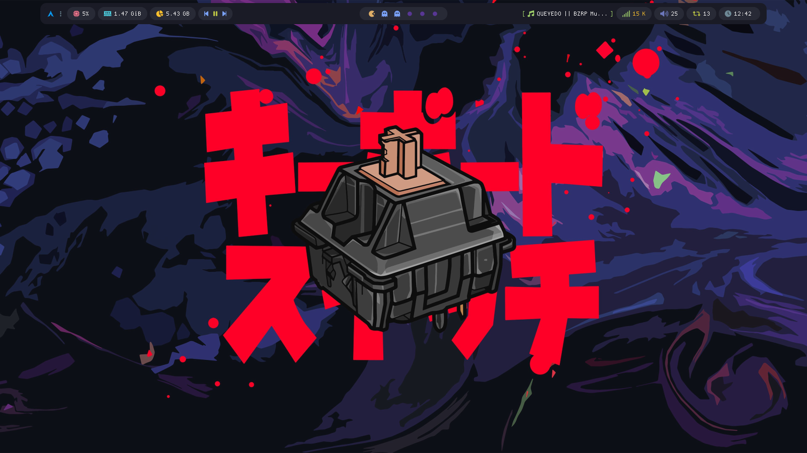||
|---|---|

<details>
<summary><b>Extra wallpapers in Emilia</b></summary>

||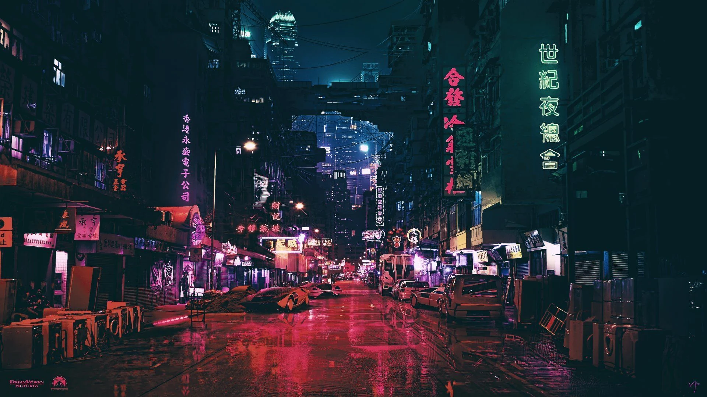||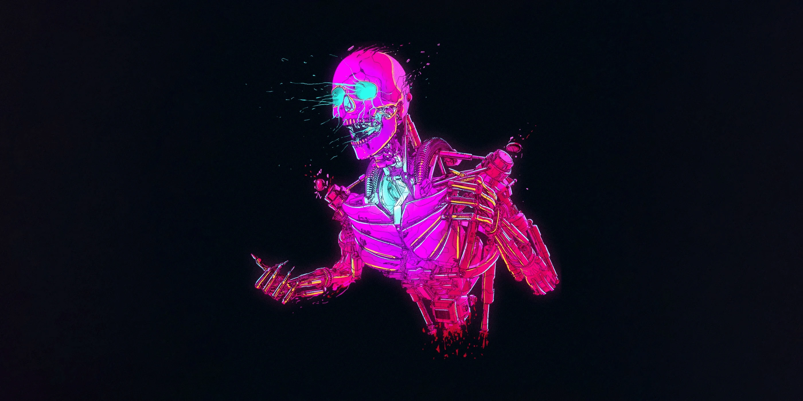|
|---|---|---|---|

</details>

### 🌸Jan

- Color Palette: <code>Cyber Punk</code>

|||
|---|---|

<details>
<summary><b>Extra wallpapers in Jan</b></summary>

||||
|---|---|---|

</details>

### 🌸Aline

- Color Palette: <code>Catppuccin Frappe</code>

|||
|---|---|

<details>
<summary><b>Extra wallpapers in Aline</b></summary>

|||
|---|---|

</details>

### 🌸Andrea

- Color Palette: <code>Holly molly i dont know..</code>

|||
|---|---|

<details>
<summary><b>Extra wallpapers in Andrea</b></summary>

|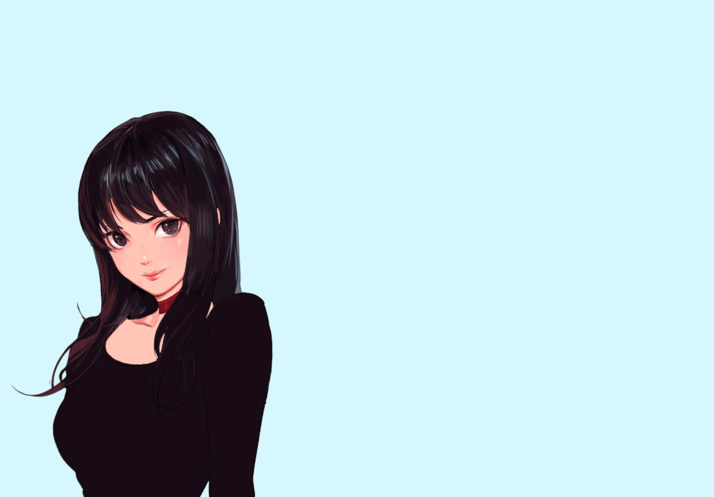|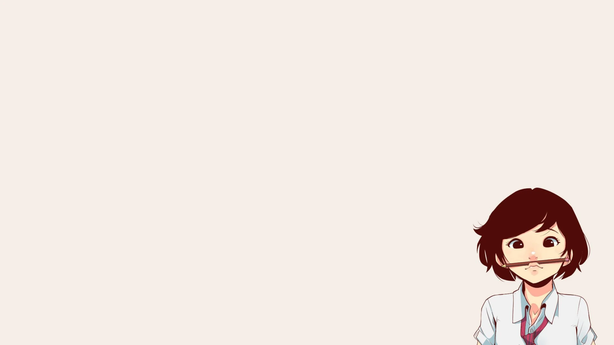|||
|---|---|---|---|

</details>

### 🌸Cynthia

- Color Palette: <code>[u/DominiCzech](https://www.reddit.com/user/DominiCzech/)</code>

|||
|---|---|

<details>
<summary><b>Extra wallpapers in Cynthia</b></summary>

|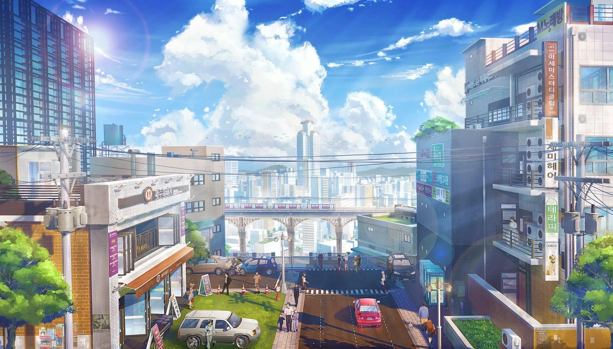||
|---|---|

</details>

### 🌸Isabel

- Color Palette: <code>One Dark</code>

|||
|---|---|

<details>
<summary><b>Extra wallpapers in Isabel</b></summary>

||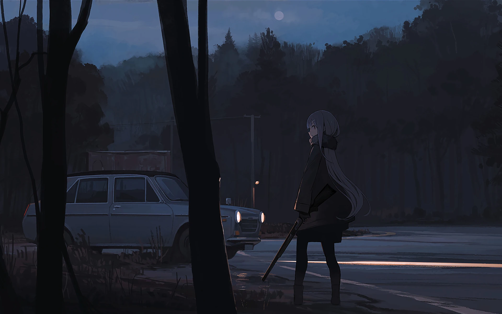|
|---|---|
</details>

### 🌸Silvia

- Color Palette: <code>GruvBox</code>

|||
|---|---|

<details>
<summary><b>Extra wallpapers in Silvia</b></summary>

||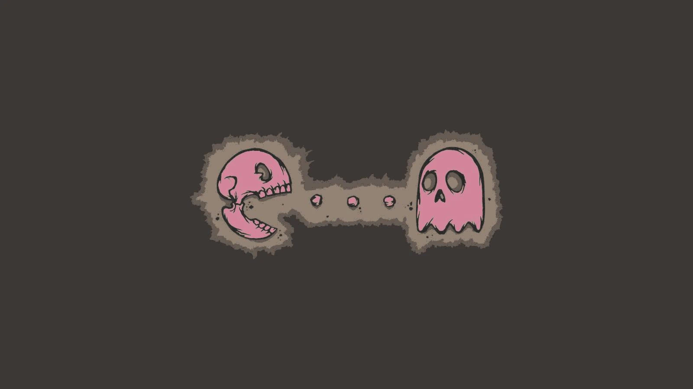|||
|---|---|---|---|

</details>

### 🌸Melissa

- Color Palette: <code>Nord</code>

|||
|---|---|

<details>
<summary><b>Extra wallpapers in Melissa</b></summary>

|||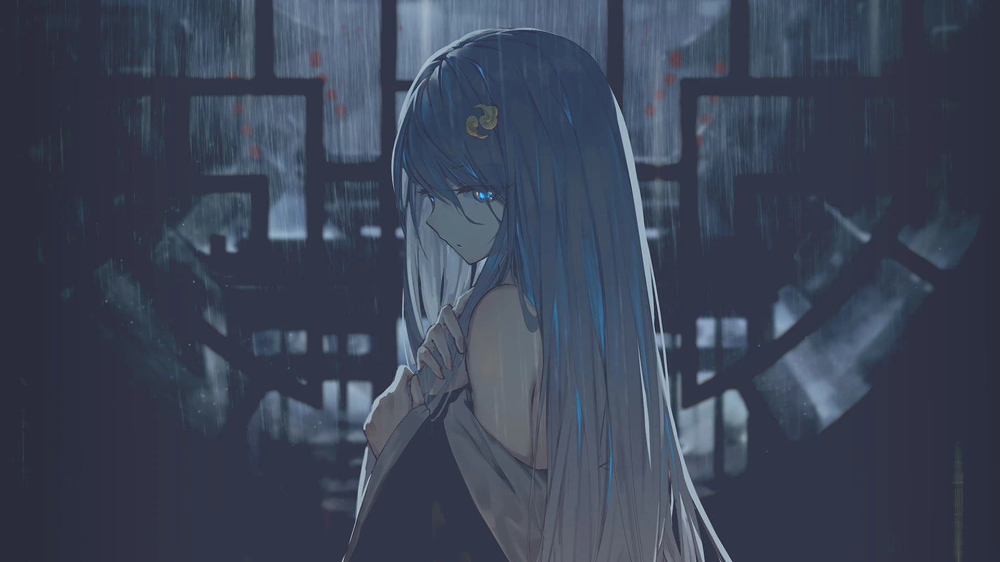|
|---|---|---|

</details>

### 🌸Pamela

- Color Palette: <code>[elenapan](https://github.com/elenapan/dotfiles)</code>

|||
|---|---|

<details>
<summary><b>Extra wallpapers in Pamela</b></summary>

||||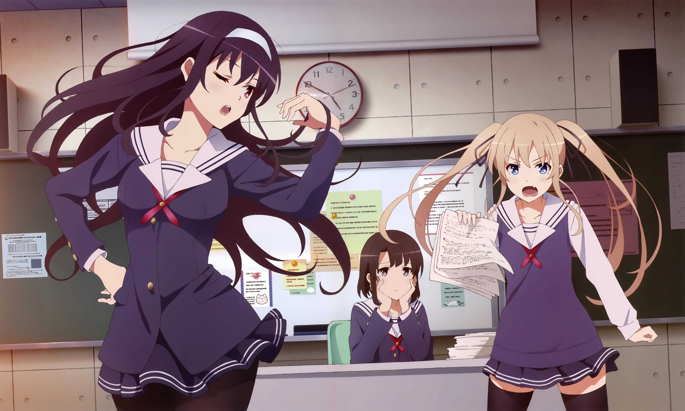
|---|---|---|---|

</details>

### 🌸Cristina

- Color palette - <code>[Rose Pine](https://github.com/rose-pine)</code>
- Main Wall - <code>[ElRastaOk](https://www.reddit.com/r/unixporn/comments/w5p7s0/hyprland_my_cute_desktop/)</code>

|||
|---|---|

<details>
<summary><b>Extra wallpapers in Cristina</b></summary>

|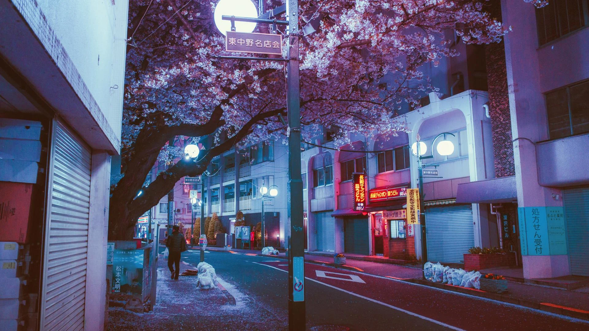||||
|---|---|---|---|

</details>

### 🌸z0mbi3:

- Color Palette: <code>Decay</code>
- With Tray icon!!

|||
|---|---|

<details>
<summary><b>Extra wallpapers in z0mbi3</b></summary>

||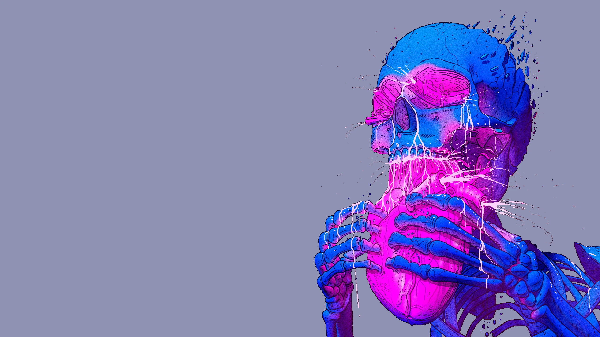|||
|---|---|---|---|

</details>


## 📦 setup

### 💾 Installation:
I will only provide instructions for arch based distributions.

<b>1. First of all we need yay and git</b>

```sh
pacman -S --needed git base-devel && git clone https://aur.archlinux.org/yay.git && cd yay && makepkg -si
```

<b>2. Install Dependencies: </b>

A one time command to install most of these dependencies with your **favorite AUR Helper** (we just install yay).

```sh
yay -S bspwm polybar sxhkd eww dunst rofi lsd jq checkupdates-aur \
playerctl mpd ncmpcpp mpc picom-arian8j2-git xtitle termite betterlockscreen \
ttf-jetbrains-mono nerd-fonts-jetbrains-mono nerd-fonts-terminus ttf-inconsolata \
ttf-joypixels nerd-fonts-cozette-ttf scientifica-font \
feh pamixer libwebp webp-pixbuf-loader xorg-xkill papirus-icon-theme
```

<b>3. Cloning Dotfiles & Installing:</b>
```sh
git clone --depth=1 https://github.com/gh0stzk/dotfiles.git

# ⚠️ Backuupp!! your filess!!!
[ -e ~/.config/bspwm ] && mv ~/.config/bspwm ~/.config/bspwm-backup-"$(date +%Y.%m.%d-%H.%M.%S)"
[ -e ~/.config/termite ] && mv ~/.config/termite ~/.config/termite-backup-"$(date +%Y.%m.%d-%H.%M.%S)"

# Moving new files to .config
cd dotfiles
cp -r config/bspwm ~/.config/bspwm
cp -r config/termite ~/.config/termite
# Those were the important ones. You still need to move the remaining directories in config to your ~/.config directory.

# Move Fonts and the other stuff
cp -r misc/fonts/* ~/.local/share/fonts/
cp -r misc/bin ~/.local/
cp -r misc/applications ~/.local/share/
cp -r misc/asciiart ~/.local/share/
fc-cache -rvre
#If the fonts are not rendered correctly, copy them manually and refresh cache

# You probably MUST use your own .zsh config, but if you want to use mine, do;
cp -r home/.zshrc ~/.zshrc
cp -r config/zsh ~/.config/zsh

# If you will not use my zsh config, just add to your .zshrc file, this;
if [ -d "$HOME/.local/bin" ] ;
  then PATH="$HOME/.local/bin:$PATH"
fi
```

<b>4. Enabling Services</b>
```sh
# For automatically launching mpd on login
systemctl --user enable mpd.service
systemctl --user start mpd.service
```
## Credits

All workflows are stolen things and forked to my way of work.
NONE ARE MINE.
